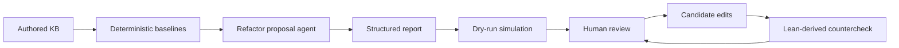
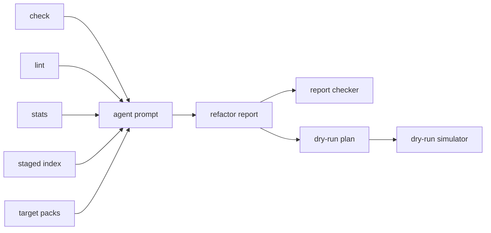
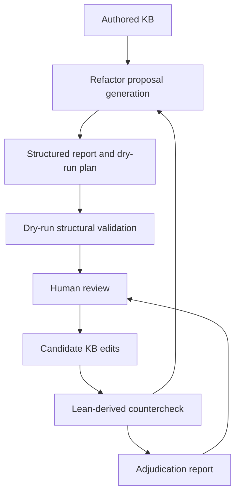

# Improving mdblueprint for Lean-backed Knowledge Graphs

From human-authored mathematical nodes to refactor proposals and Lean-derived counterchecks.

<div class="mt-12 text-sm opacity-70">
Draft deck. This version reorganizes the existing countercheck material and adds the natural-language refactor-agent workflow.
</div>

---

# The Repo in One Slide

`mdblueprint` supports a Markdown-first mathematical knowledge base.

- `nodes/`: admitted human-authored knowledge nodes
- `staged/`: draft or staged nodes
- `mdblueprint.yml`: authored dependency graph and topic structure
- `skills/`: agent workflows for authoring, review, Lean support, and publishing
- `tools/knowledge/`: deterministic validators, extractors, and graph utilities

The graph is meant to represent logical dependency, not just hyperlink structure.

---

# Problem Statement

Informal mathematical graphs are useful because humans can read and curate them.

They are fragile because formalization changes the shape of the same content.

- Lean introduces helper lemmas, bridge definitions, and proof-route artifacts
- one prose node may correspond to many declarations
- one declaration may expose dependencies that were implicit in prose
- a dependency edge may be logical, expository, or merely navigational
- a local graph edit can affect descendants in formulation-sensitive ways

The problem is not that the authored graph is wrong. The problem is that it needs review support.

---

# Source of Truth

The authored knowledge base remains the contract boundary.

```yaml
id: game_theory.strategic_game.zero_sum.von_neumann_minimax
title: Von Neumann Minimax Theorem
uses:
  - game_theory.strategic_game.zero_sum.core.value
  - math.minimax.loomis_theorem
lean:
  module: EconCSLib.GameTheory.StrategicGame.ZeroSum
  declarations:
    - MatrixGame.vonNeumannMinimax
```

Lean is a countercheck and source of evidence.

It is not an automatic replacement for authored mathematical judgment.

---

# Presentation Plan

We present the tool-suite improvement as two complementary stages.

1. **Generate proposals**

   Use node prose, graph structure, lint findings, and bounded evidence packs to propose refactors.

2. **Validate proposed changes**

   Use deterministic checks, dry runs, and Lean-derived countergraphs to test whether proposals are structurally and semantically plausible.

Together, these workflows make `mdblueprint` more robust without giving up human ownership of the graph.

---

# Shared Design Principles

- agents propose, Python tools validate
- reports and dry runs precede edits
- staged nodes can inform review without being promoted
- Lean-derived signals are advisory
- graph reachability is evidence, not proof of semantic impact
- high-value semantic refactors should outrank easy lint cleanup

The workflow is designed to make disagreement inspectable.

---

# End-to-End Shape



The feedback loop is the product.

No single pass is expected to settle mathematical truth.

---

# Artifacts Behind This Deck

Natural-language refactor workflow:

- `skills/mdblueprint-graph-refactor-review/SKILL.md`
- `tools/knowledge/refactor_pack.py`
- `tools/knowledge/refactor_report_check.py`
- `tools/knowledge/refactor_dry_run.py`
- `plans/econcslib-refactor-agent-dry-run/`
- `plans/econcslib-refactor-agent-dry-run/dry-run-output-20260614T140053Z/`

Lean countercheck workflow:

- `plans/lean-countercheck-plan.md`
- `plans/heuristic-countercheck-methodology.md`
- `plans/round3-*`
- `plans/lam0_le_mu0-audit.md`
- `tools/knowledge/lean_countercheck.py`

---

layout: section
---

# Stage 1

Generating refactor proposals.

---

# Refactor-Agent Role

The refactor agent reviews an existing knowledge graph and proposes bounded actions.

It can propose:

- dependency cleanup
- missing dependency additions
- duplicate or overlap review
- split, merge, or generalization requests
- topic taxonomy changes
- proof-plan route separation
- formulation-impact review

It does not silently rewrite admitted nodes.

---

# Evidence Pack Boundary

The full EconCSLib KB is large, so the agent is not asked to reason from an unbounded context window.

The harness prepares bounded evidence:

- structural check output
- lint JSON
- graph statistics
- staged-node id index
- high-impact target lists
- target-node and target-topic `refactor_pack` bundles

The agent reads enough local context to explain proposals, not the entire KB in one prompt.

---

# Refactor Evidence Flow



The evidence pack constrains the agent's work to auditable inputs and replayable validation commands.

---

# Refactor-Agent Judgment Rules

The useful guidance was not just "find graph problems."

The agent was instructed to:

- treat included staged nodes as graph-visible, without proposing promotion
- use a staged index before writing missing-node requests in admitted-only mode
- apply a generality gate before creating, splitting, merging, or rehoming content
- distinguish proof-route dependencies from theorem-statement dependencies
- analyze formulation-sensitive descendant impact
- run a final refinement pass before writing the report

The refinement pass keeps semantic opportunities from being crowded out by easy lint hygiene.

---

# Formulation-Sensitive Impact

Reachability only says which descendants might be affected.

It does not say how the change percolates.

A descendant may:

- remain unchanged
- need a proof-route repair
- need a weaker statement
- split into formulation-specific variants
- fail because an equivalence or bridge was removed

The agent therefore reviews exact ancestor formulations before proposing high-impact changes.

---

# Generality Gate

Before proposing a new node, split, merge, or dependency retargeting, the agent asks:

- what is the most general useful form of the result?
- does that form already exist as an admitted or staged node?
- is the narrower node a deliberate specialization?
- would a bridge lemma be better than a duplicate theorem node?
- is the uncertainty mathematical policy rather than graph hygiene?

This is the main anti-bloat rule for mathematical KB refactoring.

---

# Deterministic Tools Added

The refactor workflow added Python support around the agent.

- `refactor_pack`: builds bounded evidence around a target node or topic
- `refactor_report_check`: validates report schema and referenced ids
- `refactor_dry_run`: simulates proposed graph operations in memory
- EconCSLib dry-run harness: prepares baselines, packs, prompts, logs, and outputs

The tools are deliberately deterministic.

They do not decide mathematical truth; they make proposal review concrete.

---

# Dry-Run Operations

The simulator supports concrete plan operations:

- add or remove dependencies
- add or remove topic membership
- move primary topic
- mark Lean/topic divergence
- delete a node
- add a node from a request file
- replace a node body from explicit text, a body file, or a request file

This gives the agent enough expressive power to model realistic edits while keeping actual KB files untouched.

---

# EconCSLib Refactor Run

Latest documented run:

- mode: admitted plus staged
- loaded nodes: `535`
- admitted nodes: `273`
- staged nodes: `262`
- graph edges before dry run: `840`
- proposals in report: `12`
- simulated operations: `17`
- nodes changed in memory: `10`
- graph edges after dry run: `829`
- new errors or warnings introduced: `0`

No request files were written because relevant candidate nodes already existed as admitted or staged nodes.

---

# Proposal Categories

The final report did not only emit one kind of edit.

It separated:

- mechanical-safe cleanup
- semantic review
- formulation-impact review
- duplicate or overlap review
- topic ownership decisions
- proof-plan route separation
- admission-referee decisions

That classification matters because only a few proposals are suitable for direct dry-run simulation.

---

# Case Study: Minimax Proof Routes

The agent identified `game_theory.strategic_game.zero_sum.von_neumann_minimax` as a high-value review target.

The key judgment was not "add every referenced dependency."

It was:

- theorem descendants rely on the minimax statement
- proof-route details belong on proof-plan nodes where possible
- Loomis-route dependencies should not automatically become theorem prerequisites
- bulk `LINT_PROSE_DEP` repair could bloat the graph

This is a useful semantic distinction that a purely mechanical linter would not make.

---

# Case Study: Fair-Division Variants

The agent found overlap among allocation and instance nodes.

It did not propose a merge.

Instead, it proposed missing specialization ancestry:

- indivisible allocation uses generic allocation
- divisible ordinal instance uses divisible allocation
- indivisible cardinal instance uses indivisible ordinal instance

The generality gate treats shared prose as specialization structure, not automatic duplication.

---

# Case Study: Catalog Cleanup

Some staged catalog nodes had navigation-only `uses` edges.

The agent proposed removing these from the logical dependency graph:

- finite-game catalog dependencies
- extensive-game theorem catalog dependencies

The dry run showed these were structurally safe and reduced artificial topic-cycle pressure.

This is a good example of small mechanical cleanup surviving semantic prioritization.

---

# What the Agent Avoided

The final report deliberately avoided several tempting actions.

- no staged-node promotion proposals
- no duplicate request files for staged ids
- no mechanical merge of strong-complementarity variants
- no merge of player-1 and player-2 LP formulations
- no broad topic move from Lean module names alone
- no automatic body rewrite for high-degree core definitions

This restraint is part of the contribution.

---

# Proposal Quality Criteria

A good refactor proposal should:

- name exact target nodes and operations
- explain evidence and risk
- identify descendant impact
- distinguish structural safety from mathematical judgment
- provide validation commands
- leave uncertain mathematical decisions to human or admission review

The report checker enforces the durable structure.

The dry run checks the executable subset.

---

layout: section
---

# Stage 2

Validating proposed changes with Lean-derived counterchecks.

---

# Why Countercheck?

The authored graph can drift from the Lean formalization.

Counterchecking helps identify:

- missing theorem-local helpers
- new formalization lemmas not represented as nodes
- declaration clusters hidden inside one prose node
- conceptual edges that Lean does not expose lexically
- proof-local dependencies introduced by autoformalization
- suspicious mappings between declarations and nodes

The output is a ranked review signal, not an automatic patch.

---

# Lean-Derived Extraction

The round3 workflow uses source-text extraction instead of Lake compilation.

It scans Lean files for:

- `theorem`
- `lemma`
- `def`
- `abbrev`
- `example`

This keeps the workflow cheap and reproducible.

It also means the extractor is heuristic, so adjudication is required.

---

# Dependency Extraction Algorithm

For each declaration:

1. slice the declaration body from source text
2. strip line and block comments
3. scan name-like tokens
4. resolve tokens against the project declaration corpus
5. normalize accessors such as `.mp` and `.mpr`
6. emit declaration-to-declaration edges

String normalization:

- lowercase
- strip non-alphanumeric separators
- compare full names
- compare basenames as fallback

---

# Mapping Back to Nodes

Lean declarations are projected onto authored nodes by matching candidate labels.

Candidate labels include:

- node id
- node title
- node file stem
- `lean.declarations`
- declaration basenames

The mapping is intentionally many-to-one.

A single authored node can cover a cluster of definitions, helper lemmas, and theorems. 

---

# Adjudication Layer

The adjudicator classifies mismatches case by case.

Possible outcomes:

- true discrepancy
- false abend
- needs review

It should accept wrapper-style mappings when the authored node is a conceptual anchor.

It should penalize obvious errors such as unrelated theorem-to-definition mappings, comment leakage, and helper-lemma noise.

---

# Case Study: Cardinal-Instance Wrappers

`social_choice.fair_division.cardinal_instance_wrappers` is a definition-style wrapper.

Lean exposes a cluster underneath it:

- `IsEnvyFree`
- `IsProportional`
- `IsEquitable`
- `IsParetoOptimal`
- `utilitarianWelfare`
- `egalitarianWelfare`
- `IsUtilitarianOptimal`
- `IsMaxmin`

The improvement opportunity is not to delete the wrapper.

It is to preserve it as a conceptual anchor while reviewing the declaration cluster.

---

# Case Study: Minimax Foundations

`game_theory.strategic_game.zero_sum.lam_mu_existence` packages several proof phases:

1. continuity
2. boundedness
3. existence of optimizers
4. weak duality

The Lean side exposes finer-grained declarations such as continuity lemmas, bound lemmas, optimizer existence, and `lam0_le_mu0`.

This supports an internal split or proof-plan follow-up without claiming the authored node is wrong.

---

# Countercheck Limitations

The source-text method is cheap and reproducible, but limited.

- it cannot prove semantic necessity
- it can over-collect helper lemmas
- it can under-recover conceptual authored edges
- it depends on string normalization and naming conventions
- catalog and summary nodes need special treatment

We have considered methods relying on Lean compilation paths. However, decisions to simplify nodes are human judgments which could not be captured in a rigid rule-based approach. The solution would be to finetune the prompt of the adjudicator to suit the specific use case of EconCSLib. 

---

layout: section
---

# Integration

One tool suite, two review directions.

---

# How the Two Stages Fit



Proposal generation asks: what should we review or change?

Counterchecking asks: what does Lean-derived evidence say about those choices?

---

# Complementary Strengths

| Workflow | Strong at | Weak at |
| --- | --- | --- |
| refactor agent | semantic triage, generality, formulation impact, bounded proposal writing | proving correctness, detecting all Lean-local dependencies |
| dry-run simulator | exact structural consequences of proposed operations | mathematical truth |
| Lean countercheck | surfacing formalization drift and declaration granularity | deciding authored graph ownership |
| adjudicator | classifying mismatches for review | replacing human mathematical policy |

The combined workflow makes each limitation explicit.

---

# Review Policy

Different signals should route to different owners.

- redundant edge with preserved reachability: dry-run and structural check
- missing specialization dependency: semantic review plus dry run
- staged overlap: admission-referee workflow
- high-degree definition change: formulation-impact review
- Lean module/topic mismatch: taxonomy policy review
- declaration cluster hidden in one node: adjudicated countercheck proposal

This keeps refactoring, admission, and Lean alignment from collapsing into one task.

---

# What This Adds to mdblueprint

The repo gains a more complete improvement loop.

Before:

- validate and publish authored nodes
- optionally compare against Lean-derived artifacts

After:

- generate bounded graph-refactor proposals
- structurally simulate concrete graph edits
- preserve staged-node optionality
- use formulation-sensitive impact analysis
- countercheck proposals and authored graph against Lean-derived signals

The workflow stays review-first throughout.

---

# Holistic Outcome

The useful result is not any single tool, but the way the stages sharpen one
another.

- the refactor stage found a bounded proposal that was actually worth making
- the dry-run stage confirmed the proposal was mechanically safe
- the Lean countercheck stage showed where the wrapper family is structurally
  clean and where normalization still needs work
- the adjudication layer separates true discrepancies from false abends instead
  of treating every mismatch as an error

In the fair-division integration run:

- proposal pack scope: `social_choice.fair_division.divisible.cardinal_instance`
  and `social_choice.fair_division.indivisible.cardinal_instance`
- accepted edits: explicit allocation ancestry for both wrapper nodes
- dry-run effect: `840 -> 842` edges, no errors introduced
- Lean countercheck: `2` nodes checked against a single precomputed corpus
- review outcome: the wrapper family is semantically meaningful, but the
  current matcher still over-collects helper artifacts

That is the value add of the full pipeline when it works together:

1. it proposes small graph improvements instead of forcing broad rewrites
2. it validates that the proposal is structurally safe before any edit
3. it exposes where Lean evidence supports the proposal and where the
   normalization layer still needs refinement
4. it leaves the final judgment with a human or adjudicator, not a rule

---

# What Improved

The combined workflow improved four things at once:

- proposal quality: bounded evidence packs made the first-stage suggestion
  concrete instead of speculative
- structural safety: dry-run simulation prevented accidental graph damage
- formal review quality: the countercheck surfaced declaration-cluster and
  helper-lemma noise explicitly
- judgment quality: adjudication distinguishes true discrepancies from false
  abends, so the review loop can focus on real issues

The headline outcome is simple:

- `mdblueprint` now has a repeatable path from graph idea -> dry-run -> Lean
  countercheck -> final judgment
- the pipeline is still review-first
- the pipeline is now better at showing *why* a change should or should not be
  accepted

---

# Remaining Gaps

The integrated run also exposed what still needs attention.

- wrapper-family normalization is still too coarse in the counterchecker
- helper lemmas and accessors still leak into the extracted evidence set
- some legitimate conceptual anchors are finer-grained than the authored node
- the final adjudication step remains necessary because Lean evidence is not
  the same thing as authored graph truth

These are not failures of the workflow.

They are exactly the kind of refinement targets the workflow is supposed to
surface.
