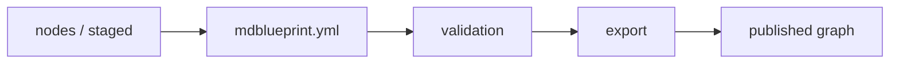

# mdblueprint Counterchecking for EconCSLib

Using Lean-derived signals to review a human-authored mathematical dependency graph.

<div class="mt-12 text-sm opacity-70">
Draft deck. Built from the round3 source-text countercheck reports and rerun review note.
</div>

---

# Problem Setup

EconCSLib is a Lean formalization project for economics and game theory.

The authored knowledge base lives in:

- `nodes/`: human-authored knowledge nodes
- `staged/`: draft or staged nodes
- `mdblueprint.yml`: authored dependency graph structure

Nodes can be Lean-backed through metadata such as:

```yaml
lean:
  module: EconCSLib.Some.Module
  declarations:
    - declaration_name
uses:
  - another.authored.node
```

The authored graph is the source of truth. Lean is used as a countercheck.

---

# Existing mdblueprint Pipeline

mdblueprint originally consumes authored knowledge files and emits a navigable dependency graph.



The core tool does not begin from monolithic Lean files.

It expects humans and agents to author the knowledge objects first, then validates and publishes them.

---

# Why Countercheck?

The dependency graph is human generated, so several classes of drift can appear.

- a node may omit a useful dependency
- a node may include an edge that is conceptually too broad
- autoformalization may introduce helper lemmas not present as nodes
- Lean declarations may be finer-grained than the authored node
- authored nodes may be intentionally informal or backed by `sorry`

The goal is review, not automatic replacement.

---

# Solution Shape

The workflow has two complementary parts.

1. Use natural language review over the authored knowledge base to propose useful refactors, lemmas, or conjectures.
2. Generate a Lean-derived countergraph from source text to identify drift, new lemmas, and suspicious edges.

The countergraph is advisory.

The adjudicator decides whether a mismatch is:

- a true discrepancy
- a false abend
- a needs-review case

---

# Informal Refactor Pass

Placeholder for the natural-language section.

This pass should read the authored nodes as mathematical prose and ask:

- are there repeated proof ideas that should become named lemmas?
- are there concepts whose dependencies are implicit?
- are there definitions with theorem clusters that deserve better organization?
- are there conjectures or staged nodes that would clarify the graph?

This is deliberately not limited to what appears in Lean.

---

# Lean-Derived Node Extraction

The round3 implementation uses source-text extraction, not Lake compilation.

It scans Lean files for declaration forms:

- `theorem`
- `lemma`
- `def`
- `abbrev`
- `example`

Definitions are first-class signals. A definition node can legitimately contain theorem-backed facts when it acts as a conceptual wrapper.

This avoids the cost of `lake build`, while still giving a useful review signal.

---

# Dependency Extraction Algorithm

For each declaration:

1. slice the declaration body from source text
2. strip line and block comments
3. scan name-like tokens
4. resolve tokens against the project declaration corpus
5. normalize accessors such as `.mp` and `.mpr`
6. emit declaration-to-declaration edges

String normalization used for matching:

- lowercase
- strip non-alphanumeric separators
- compare full names
- compare basenames as a fallback

This is factual with respect to source text, but still heuristic.

---

# Mapping Back to EconCSLib

The countergraph is projected onto the authored graph by matching Lean declarations to nodes.

Candidate labels include:

- node id
- node title
- node file stem
- `lean.declarations`
- declaration basenames

The mapping is many-to-one by design.

A single authored node can cover a cluster of definitions, helper lemmas, and theorems.

---

# Adjudication Layer

The adjudicator is the final filter.

It accepts wrapper-style mappings when the authored node is clearly a conceptual anchor.

It flags obvious oversights, including:

- theorem mapped to an unrelated definition node
- comment leakage
- accessor normalization misses
- helper lemma leakage
- many-to-one mappings that change semantic intent

The output is a report, not an automatic edit to `nodes/` or `mdblueprint.yml`.

---

# Full-Run Inventory

Round3 source-text run:

- authored EconCSLib docs in `nodes/` and `staged/`: `535`
- authored docs with `lean.declarations`: `322`
- extracted declaration records: `1,590`
- extracted dependency edges in the fresh rerun: `4,761`
- authored nodes matched to at least one record: `249`
- declaration records matched to authored nodes: `719`
- declaration records left unmapped: `871`

At graph level:

- round3 graph nodes: `1,464`
- additional graph nodes beyond authored inventory: `929`

The rerun keeps the same theorem count but increases the dependency signal after
comment stripping and accessor normalization. That makes the review proposals
sharper even when the source inventory does not change.

---

# Edge-Level Results

Earlier projection baseline against the published blueprint graph:

- projected node set: `254`
- blueprint node set: `535`
- projected edges: `963`
- blueprint edges: `840`
- overlapping edges: `154`
- projected-only edges: `809`
- blueprint-only edges: `686`

Measured alignment:

- precision: `0.1599`
- recall: `0.1833`

Low precision and recall are not automatically failures. The graphs have different granularity.
The fresh rerun was used to sharpen proposal quality; it did not recompute the
blueprint comparison because no fresh local blueprint checkout was available.

---

# Genuine Improvement Categories

Useful signals from the Lean-derived pass:

- missing theorem-local helpers
- new formalization lemmas not represented as authored nodes
- declaration clusters hidden inside a single high-level node
- wrapper-heavy definitions that should stay curated but be reviewed through a second-stage reducer
- theorem clusters where one authored node spans several Lean declarations
- authored edges that are conceptual rather than lexical
- proof-local drift caused by autoformalization

The most useful output is not a replacement graph.

It is a ranked list of nodes and edges worth human review.

---

# Case Study: Cardinal-Instance Wrappers

`social_choice.fair_division.cardinal_instance_wrappers` is a stronger value-add example from the rerun.

The authored node is a definition-style wrapper, but it aggregates a family of distinct Lean declarations:

- `IsEnvyFree`
- `IsProportional`
- `IsEquitable`
- `IsParetoOptimal`
- `utilitarianWelfare`
- `egalitarianWelfare`
- `IsUtilitarianOptimal`
- `IsMaxmin`

The improvement opportunity is not to delete the wrapper. It is to preserve it as a conceptual anchor while surfacing the declaration cluster as a reviewable source-improvement proposal.

This suggests a concrete second-stage reducer:

- keep the authored wrapper node intact
- attach the underlying theorem/definition cluster as review evidence
- flag any extra or missing wrapper-local `uses` edges for human review

---

# Case Study: Minimax Foundations

`game_theory.strategic_game.zero_sum.lam_mu_existence` is the stronger theorem-cluster example from the rerun.

The authored node packages four conceptual facts:

1. continuity
2. boundedness
3. existence of optimizers
4. weak duality

The Lean side exposes a finer-grained cluster:

- `MinimaxLoomis.lam.aux.continuous`
- `MinimaxLoomis.mu.aux.continuous`
- `MinimaxLoomis.lam.aux.bddAbove`
- `MinimaxLoomis.mu.aux.bddBelow`
- `MinimaxLoomis.lam.aux.le_lam0`
- `MinimaxLoomis.mu.aux.ge_mu0`
- `MinimaxLoomis.exists_xx_lam0`
- `MinimaxLoomis.exists_yy_mu0`
- `MinimaxLoomis.lam0_le_mu0`

This shows a possible way to split up the individual nodes further:
- the authored node is conceptually sound, but it compresses several proof phases into one bucket
- the Lean-derived countergraph can propose an internal split or a staged follow-up node for the intermediate existence / weak-duality facts
- the review layer can distinguish between a real source improvement and a harmless theorem cluster generated by formalization

In other words, the agent can suggest a meaningful refinement without claiming the original node was wrong.

---

# What Went Wrong There?

The matcher can attach theorem-level proof detail to the wrong authored node.

That can be legitimate when the node is a conceptual wrapper.

It becomes an obvious oversight when:

- the theorem is unrelated to the definition node
- the node title and Lean declaration disagree semantically
- the mapping only works through a weak basename match
- the projected edge changes the intended authored dependency graph

The adjudicator should penalize these cases through random spot checks and flag them as sanity failures.

---

# Limitations

The source-text method is cheap and reproducible, but limited.

- it cannot prove that a dependency is semantically necessary
- it can over-collect helper lemmas
- it can under-recover conceptual authored edges
- it depends on string normalization and naming conventions
- catalog or summary nodes need special treatment

It should remain a counterchecker and proposal generator.

---

# Further Work

Potential stronger methods:

- compile selected Lean files and inspect actual elaborated dependencies
- run Lake file-by-file instead of building the entire repository
- retry `lean-lsp-mcp` when the build/cache story is cheaper
- use hosted Lean execution to avoid local Lake setup
- add a randomized LLM-as-a-judge spot-check layer for obvious mapping mistakes

The next engineering target is a better adjudicator, not a denser graph.
